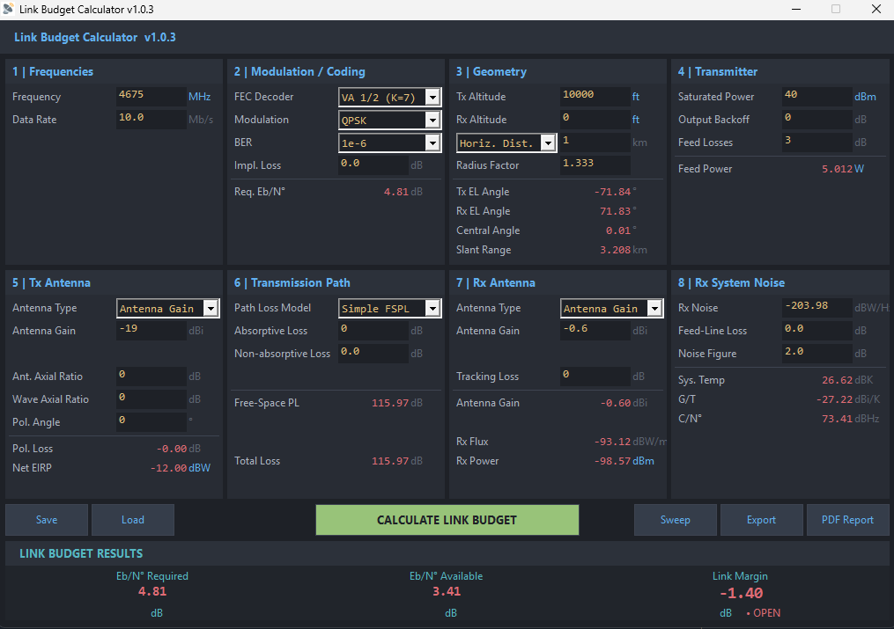

# Link Budget Calculator — Free Windows RF & Satellite Link Budget Tool

A free, open-source Windows GUI for RF and satellite link budget analysis. Calculate free-space path loss (FSPL), EIRP, C/N0, Eb/N0, and link margin with ITU-R atmospheric attenuation models — no MATLAB or spreadsheet required. Built as a lightweight native Win32 application in C.


## Screenshot



## Use Cases

- **Satellite link budget** — compute end-to-end C/N0 and Eb/N0 for LEO, MEO, or GEO satellite links with rain and gaseous attenuation
- **RF link design** — size antennas, select transmit power, and verify link margin for point-to-point microwave or telemetry links
- **Classroom / self-study** — learn how FSPL, antenna gain, noise temperature, and modulation interact in a real link budget
- **Quick trade studies** — sweep any parameter (frequency, distance, antenna diameter, rain rate) and find the zero-margin crossing instantly

## Features

- **8-section input panel** — frequency, modulation/coding, geometry, transmitter, TX antenna, path loss, RX antenna, RX system noise
- **Antenna modes** — direct gain input or parabolic dish (auto-computes gain and beamwidth)
- **Geometry modes** — slant range or horizontal distance with altitude
- **Path loss models** — simple FSPL (Friis transmission equation) or ITU-R (P.676-12 gaseous + P.838-3 rain attenuation)
- **Clickable unit cycling** — frequency (GHz/MHz/kHz), altitude (m/ft/km/NM), power (W/dBm/dBW)
- **Sweep plot** — margin vs. any parameter with zero-crossing detection and interactive crosshair
- **Save / Load** — `.lbf` scenario files for repeatable analysis
- **CSV export** — all inputs and computed results
- **PDF report** — direct PDF 1.4 output, no printer driver required
- **Portable** — single `.exe`, no installation needed

## Installation

Download the latest release from the [Releases page](https://github.com/galenthas/link-budget-calculator/releases):

- **`LinkBudgetCalculator_vX.X.X_Setup.exe`** — Windows installer (no admin rights required)
- **`Link Budget Calculator.exe`** — portable, runs without installation

## How It Works

The calculator implements the standard RF link budget equation:

**Link Margin = EIRP - Path Loss + G/T - Required Eb/N0 - Implementation Loss**

All intermediate values (EIRP, free-space path loss, atmospheric attenuation, antenna gain, system noise temperature, C/N0, Eb/N0) are computed and displayed. When ITU-R mode is selected, oxygen and water vapour attenuation follow ITU-R P.676-12 Annex 2, and rain attenuation follows ITU-R P.838-3. The sweep plot varies one parameter while holding everything else constant, plotting margin and marking the exact zero-crossing point.

## FAQ

### What is a link budget?

A link budget is an accounting of all gains and losses in a radio communication system — from transmitter power through antenna gains, path loss, and receiver sensitivity — to determine whether a signal arrives with enough strength to be decoded. Link Budget Calculator automates this calculation with a graphical interface.

### Does it support satellite link budgets?

Yes. You can enter slant range or horizontal distance with altitude, choose between FSPL and ITU-R atmospheric models (oxygen, water vapour, rain), and compute C/N0 and Eb/N0 for any orbit — LEO, MEO, or GEO.

### What path loss models are included?

Two models: simple free-space path loss (Friis equation) and ITU-R extended mode with gaseous attenuation (P.676-12 Annex 2) plus rain attenuation (P.838-3).

### Do I need MATLAB or Excel?

No. Link Budget Calculator is a standalone Windows application. There is no dependency on MATLAB, Python, or spreadsheet software.

### Can I generate a report?

Yes. The calculator exports PDF reports (direct PDF 1.4 generation, no print driver needed) and CSV files with all inputs and computed results.

### Is it free?

Yes. MIT licensed — free for personal, educational, and commercial use.

## Alternatives

| Tool | GUI | Free | Offline | Sweep Plot | Standards |
|---|---|---|---|---|---|
| **Link Budget Calculator** | Native Win32 | Yes (MIT) | Yes | Yes | ITU-R P.676, P.838 |
| MATLAB link budget scripts | No (scripts) | No | Yes | Manual | Varies |
| Excel spreadsheets | Spreadsheet | Varies | Yes | Manual | Varies |
| SatNOGS | Web | Yes | No | No | Basic FSPL |
| Pathloss 5 | Yes | No (commercial) | Yes | Yes | ITU-R full suite |

Link Budget Calculator is the only free, offline, native GUI tool that includes ITU-R atmospheric and rain attenuation models with a built-in parameter sweep plot.

## Keyboard Shortcuts

| Key | Action |
|---|---|
| `F5` | Recalculate |
| `Ctrl+S` | Save scenario |
| `Ctrl+O` | Load scenario |
| `Ctrl+E` | Export CSV |
| `Ctrl+P` | PDF report |
| `Ctrl+W` | Sweep plot |

## Build

Requires [MSYS2](https://www.msys2.org/) with the MinGW-w64 toolchain.

```bash
# Install dependencies (once)
pacman -S mingw-w64-x86_64-gcc

# Build
PATH="/c/msys64/mingw64/bin:$PATH" windres app.rc -O coff -o app.res
PATH="/c/msys64/mingw64/bin:$PATH" gcc -Wall -Wextra -std=c11 -O2 \
    linkbudget_gui.c linkbudget_ui_controls.c linkbudget_ui_logic.c \
    linkbudget_ui_io.c linkbudget_pdf.c linkbudget_core.c app.res \
    -o "Link Budget Calculator" -lcomctl32 -lcomdlg32 -mwindows -lm

# Run tests
PATH="/c/msys64/mingw64/bin:$PATH" gcc -Wall -Wextra -std=c11 -O2 \
    linkbudget_core.c test_linkbudget.c -o test_linkbudget -lm
./test_linkbudget
```

## Project Structure

| File | Description |
|---|---|
| `linkbudget_core.c/h` | Physics engine — FSPL, EIRP, C/N0, Eb/N0, ITU-R models |
| `linkbudget_gui.c` | WinMain, WndProc, sweep window, tooltips, owner-draw buttons |
| `linkbudget_gui_config.h` | Layout constants, colours, control IDs |
| `linkbudget_ui_controls.c/h` | Section builders, control creators, panel WndProcs |
| `linkbudget_ui_logic.c/h` | Visibility, unit cycling, parameter extraction, calculation |
| `linkbudget_ui_io.c/h` | Save/load scenario, CSV export |
| `linkbudget_pdf.c/h` | PDF report generation |
| `test_linkbudget.c` | 141 unit tests |
| `version.h` | Single-source version definition |
| `installer.iss` | Inno Setup installer script |

## Versioning

Version is defined in `version.h`. To release a new version, update the three defines and tag:

```c
#define VERSION_MAJOR 1
#define VERSION_MINOR 1
#define VERSION_PATCH 1
```

```bash
git tag v1.1.1 && git push origin v1.1.1
```

CI will automatically build the installer and portable `.exe` and attach both to the GitHub Release.

## Physics Models

| Model | Standard |
|---|---|
| Free-Space Path Loss | Friis transmission equation |
| Oxygen attenuation | ITU-R P.676-12 Annex 2 |
| Water vapour attenuation | ITU-R P.676-12 Annex 2 |
| Rain attenuation | ITU-R P.838-3 |
| Parabolic antenna gain | G = η(πD/λ)² |
| Antenna beamwidth | θ = 67λ/D |
| System noise temperature | Cascade noise model (Friis) |
